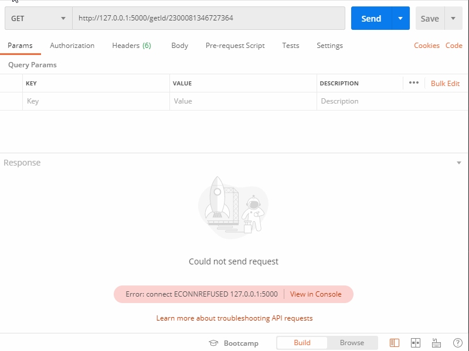
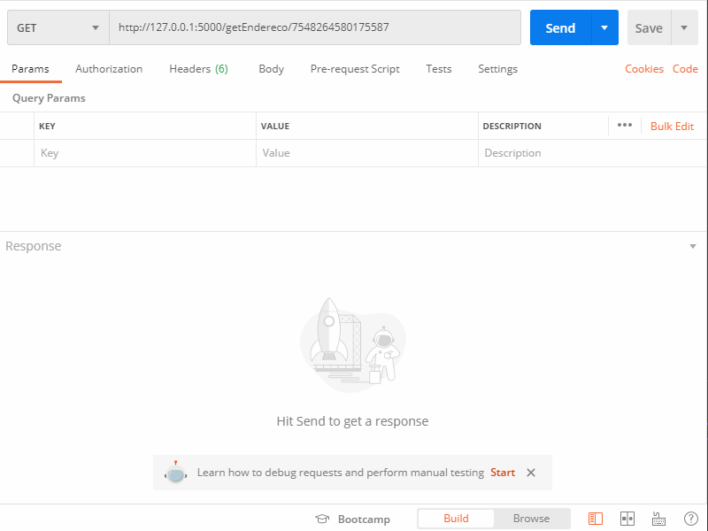
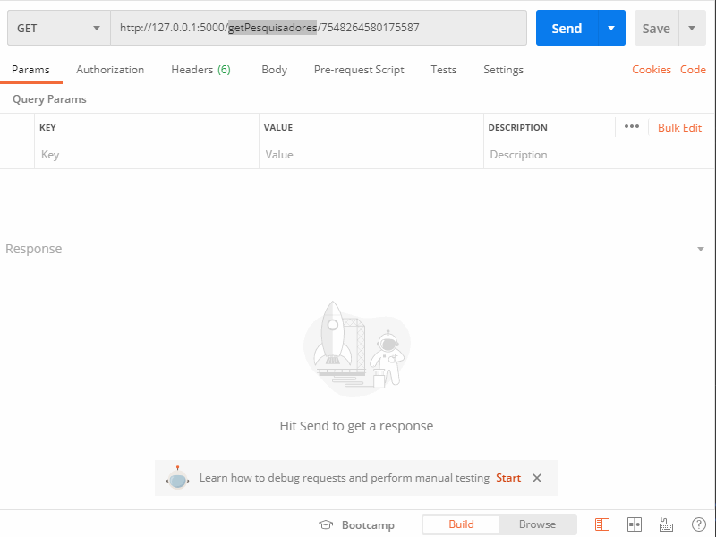

><i>"...ele sempre concede exatamente aquilo que desejamos, esse é o problema..."</i>

# Conteúdo

1. [Sobre o Gaunter](#sobre)

2. [Requisitos](#requisitos)

3. [Instalação](#install)

4. [Utilização](#utilizacao)

5. [Rotas](#rotas)


# <h2 id="sobre">1. Sobre o Gaunter</h2>

Gaunter é um Web Scrapper que captura informações das páginas Espelhos dos Grupos de Pesquisa cadastrados no <a href="http://lattes.cnpq.br/web/dgp#">DGP - Diretório de Grupos de Pesquisa do CNPq.</a>


A imagem abaixo mostra um exemplo de página espelho de um Grupo de Pesquisa do Diretório e Grupos de Pesquisa do CNPq.


Abaixo está ilustrado um exemplo do Gaunter coletando informações da mesma página demonstrada acima. O Gaunter atualmente é composto por 7 rotas GET responsáveis cada uma por extrair uma parte das informações constantes nos Espelhos dos Grupos de Pesquisa cadastrados no DGP. Na ilustração abaixo é feita uma requisição para um rota que retorna informações de Identificação do Grupo de Pesquisa.


# <h2 id="requisitos">2. Requisitos</h2>
<ul>
<li><a href="https://www.python.org/">Python 3</a></li>
<li><a href="https://requests.readthedocs.io/en/master/">Requests</a></li>
<li><a href="https://www.crummy.com/software/BeautifulSoup/bs4/doc.ptbr/">Beautifull Soup 4 </a></li>
<li><a href="https://flask.palletsprojects.com/en/1.1.x/">Flask</a></li>
</ul>

# <h2 id="install">3. Instalação</h2>
Certifique-se de ter o Python3 instalado na máquina bem como o gerenciador de pacotes do python <a href="https://pypi.org/project/pip/">pip</a>.
<h3>Instale as dependências</h3>

```console
$ pip install requests Flask beautifulsoup4
```
<h3>Faça o clone do repositório</h3>

```console
$ git clone https://github.com/alsgil13/gaunter.git
```

<h3>Inicie o Gaunter</h3>

```console
$ python ~/Gaunter/api/routes.py
```


# <h2 id="utilizacao">4. Utilização</h2>
Todas a rotas devem receber o código númerico que identifica o grupo. Este código é encontrado no final das URLs dos espelhos dos Grupos de Pesquisa. As rotas são estruturadas da seguinte maneira:

> [endereço.do.host] / [nomeDaRota] / [CódigoDeIdentificaçãoDoGrupo]


<h5>Exemplo:</h5>
Grupo de pesquisa em Paleoherpetologia

Endereço para acessar o espelho do Grupo: <a href="dgp.cnpq.br/dgp/espelhogrupo/2300081346727364">dgp.cnpq.br/dgp/espelhogrupo/<b>2300081346727364</b></a>

Neste caso o código que identifica o grupo é: 2300081346727364

Para acessarmos a rota que busca as informações de Identificação do Grupo de Pesquisa em Paleoherpetologia devemos fazer uma solicitação GET para a seguinte rota:

> [endereço.do.host]/getId/2300081346727364


# <h2 id="rotas">5. Rotas</h2>

<h3>Identificação</h3>

> [host]/getId/\<codigo>

Retorna um Json com todas as informações de Identificação do Grupo
<h5>Exemplo:</h5>

```json
{
    "Identificação": {
        "Nome": "Nome do Grupo",
        "Situação do grupo": "Status do certificado",
        "Ano de formação": "2004",
        "Data da Situação": "10/01/2013 12:55",
        "Data do último envio": "20/05/2020 19:12",
        "Líder(es) do grupo": ["Lider 1", "Lider 2"],
        "Área predominante": "Ciências Exatas e da Terra; Física",
        "Instituição do grupo": "Universidade",
        "Unidade": "Unidade/Departamento"
    }
}
```


<h3>Endereço</h3>

> [host]/getEndereco/\<codigo>

Retorna um Json com todas as informações de Endereço do Grupo
<h5>Exemplo:</h5>

```json
{
    "Endereço": {
        "Logradouro": "Avenida __________",
        "Número": "000",
        "Complemento": "...",
        "Bairro": "Nome do Bairro",
        "UF": "UF",
        "Localidade": "Cidade",
        "CEP": "00000000",
        "Caixa Postal": "...",
        "Latitude": "...",
        "Longitude": "...",
        "Telefone": "(XX) XXXX-XXXX",
        "Fax": "(XX) XXXX-XXXX",
        "Contato do grupo": "xxxx@xxxx.xx.com",
        "Website": "www.grupodepesquisa.com.br"
    }
}
```


<h3>Pesquisadores</h3>

> [host]/getPesquisadores/\<codigo>

Retorna um Json com uma lista de todos os pesquisadores
<h5>Exemplo:</h5>

```json
{
    "Pesquisadores": [
        "Nome Pesquisador 1",
        "Nome Pesquisador 2",
        "..."
    ]
}
```


<h3>Estudantes</h3>

> [host]/getEstudantes/\<codigo>

Retorna um Json com uma lista de todos os estudantes
<h5>Exemplo:</h5>

```json
{
    "Estudantes": [
        "Nome Estudante 1",
        "Nome Estudante 2",
        "..."
    ]
}
```


<h3>Técnicos</h3>

> [host]/getTecnicos/\<codigo>

Retorna um Json com uma lista de todos os técnicos
<h5>Exemplo:</h5>

```json
{
    "Técnicos": [
        "Nome Técnico 1",
        "Nome Técnico 2",
        "..."
    ]
}
```


<h3>Linhas de Pesquisa</h3>

> [host]/getLinhas/\<codigo>

Retorna um Json com uma lista de Linhas de Pesquisa cadastradas
<h5>Exemplo:</h5>

```json
{
    "Linhas de Pesquisa": [
        "Linha 1",
        "Linha 2",
        "..."
    ]
}
```


<h3>Instituições Parceiras</h3>

> [host]/getParceiros/\<codigo>

Retorna um Json com uma lista de todas as Instituições Parceiras cadastradas

<h5>Exemplo:</h5>

```json
{
    "Instituições parceiras relatadas pelo grupo": [
        "Universidade X",
        "Universidade Y",
        "..."
    ]
}
```

