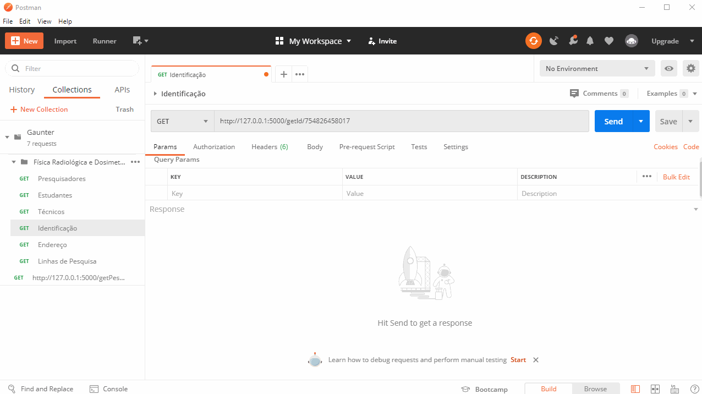

# Gaunter
Webservice que captura Informações de Espelhos de Grupos de Pesquisa do CNPq.

><i>"Ele sempre concede exatamente aquilo que desejamos. Esse é o problema"</i>




O presente webservice é composto por 7 rotas GET responsáveis cada um por extrair uma parter das informações constantes nos espelhos dos Grupos de Pesquisa cadastrados no <a href="http://lattes.cnpq.br/web/dgp#">DGP</a>. 

Todas a rotas devem receber o código númerico que identifica o grupo. Este código é encontrado no final das URLs dos espelhos dos Grupos de Pesquisa.
<hr>
<h5>Exemplo:</h5>
Grupo de pesquisa em Paleoherpetologia

Endereço para acessar o espelho do Grupo: <a href="dgp.cnpq.br/dgp/espelhogrupo/2300081346727364">dgp.cnpq.br/dgp/espelhogrupo/<b>2300081346727364</b></a>

Neste caso o código que identifica o grupo é: 2300081346727364
<hr>

<h2>Rotas</h2>
<h3>Pesquisadores</h3>

> [host]/getPesquisadores/\<codigo>

Retorna um Json com uma lista de todos os pesquisadores
<h5>Exemplo:</h5>

```json
{
    "Pesquisadores": [
        "Nome Pesquisador 1",
        "Nome Pesquisador 2",
        "..."
    ]
}
```

<h3>Estudantes</h3>

> [host]/getEstudantes/\<codigo>

Retorna um Json com uma lista de todos os estudantes
<h5>Exemplo:</h5>

```json
{
    "Estudantes": [
        "Nome Estudante 1",
        "Nome Estudante 2",
        "..."
    ]
}
```

<h3>Técnicos</h3>

> [host]/getTecnicos/\<codigo>

Retorna um Json com uma lista de todos os técnicos
<h5>Exemplo:</h5>

```json
{
    "Técnicos": [
        "Nome Técnico 1",
        "Nome Técnico 2",
        "..."
    ]
}
```

<h3>Identificação</h3>

> [host]/getId/\<codigo>

Retorna um Json com uma lista de todas as informações de Identificação
<h5>Exemplo:</h5>

```json
{
    "Identificação": {
        "Nome": "Nome do Grupo",
        "Situação do grupo": "Status do certificado",
        "Ano de formação": "2004",
        "Data da Situação": "10/01/2013 12:55",
        "Data do último envio": "20/05/2020 19:12",
        "Líder(es) do grupo": ["Lider 1", "Lider 2"],
        "Área predominante": "Ciências Exatas e da Terra; Física",
        "Instituição do grupo": "Universidade",
        "Unidade": "Unidade/Departamento"
    }
}
```

<h3>Endereço</h3>

> [host]/getEndereco/\<codigo>

Retorna um Json com uma lista de todas as informações de Endereço
<h5>Exemplo:</h5>

```json
{
    "Endereço": {
        "Logradouro": "Avenida __________",
        "Número": "000",
        "Complemento": "...",
        "Bairro": "Nome do Bairro",
        "UF": "UF",
        "Localidade": "Cidade",
        "CEP": "00000000",
        "Caixa Postal": "...",
        "Latitude": "...",
        "Longitude": "...",
        "Telefone": "(XX) XXXX-XXXX",
        "Fax": "(XX) XXXX-XXXX",
        "Contato do grupo": "xxxx@xxxx.xx.com",
        "Website": "www.grupodepesquisa.com.br"
    }
}
```

<h3>Linhas de Pesquisa</h3>

> [host]/getLinhas/\<codigo>

Retorna um Json com uma lista de Linhas de Pesquisa Cadastradas
<h5>Exemplo:</h5>

```json
{
    "Linhas de Pesquisa": [
        "Linha 1",
        "Linha 2",
        "..."
    ]
}
```

<h3>Instituições Parceiras</h3>

> [host]/getParceiros/\<codigo>

Retorna um Json com uma lista de todas as Instituições Parceiras Cadastradas

<h5>Exemplo:</h5>

```json
{
    "Instituições parceiras relatadas pelo grupo": [
        "Universidade X",
        "Universidade Y",
        "..."
    ]
}
```
